# Screenshots

A tour of the UI, using invented sample data. The full documentation is at **[wharf.forgelab.me](https://wharf.forgelab.me/)**.

## Stacks and hosts

### Dashboard
Connected hosts, active stacks and the latest deployments at a glance.

### Stacks
One row per stack with its state, worst vulnerability and live CPU, memory, network and disk; a row unfolds into one card per container with four live curves. A stack with nothing running keeps its cards, greyed.

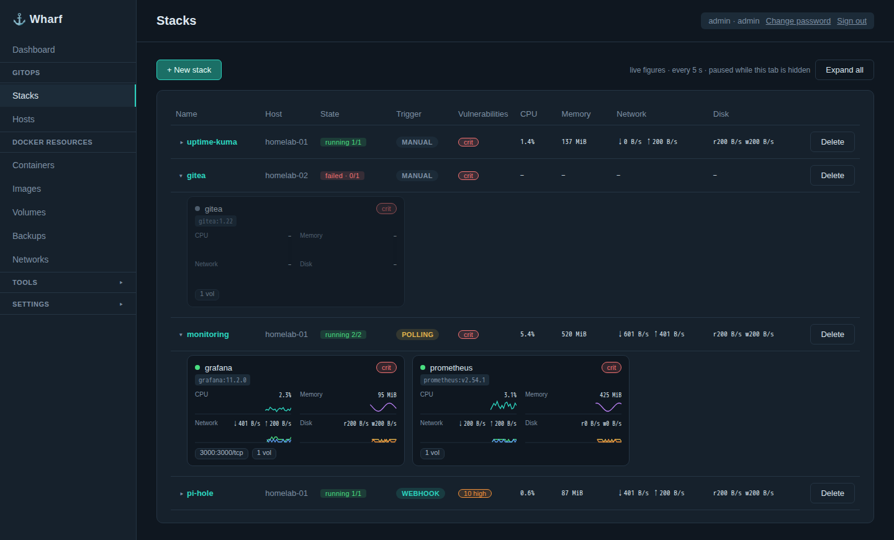

### New stack
A stack lives in Git (deployed with a dedicated deploy key or a shared connection) or is authored in Wharf. Pick a trigger — manual, webhook or polling — and the host it runs on.

### Stack
Its containers, a topology graph of what feeds them and what they use, the last deployment's output, and Deploy / Undeploy.

### Stack topology
The stack's sources, containers (with their worst vulnerability), volumes and networks, drawn left to right.

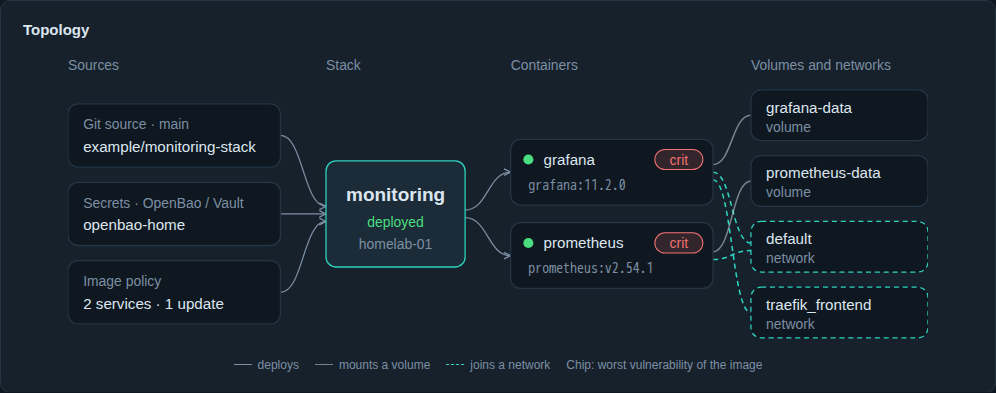

### Image update policies
Each service's image is tracked against its registry: pinned, auto-redeploy, or propose.

### Hosts
An agent shows up as pending until you approve it; its certificate fingerprint is pinned from then on.

### Host
A topology of the host's containers, live CPU, memory and I/O across them, and Docker's disk footprint.

### Host topology
Containers grouped by stack, each with its image, vulnerabilities, networks and volumes; a legend says which stacks a network links.

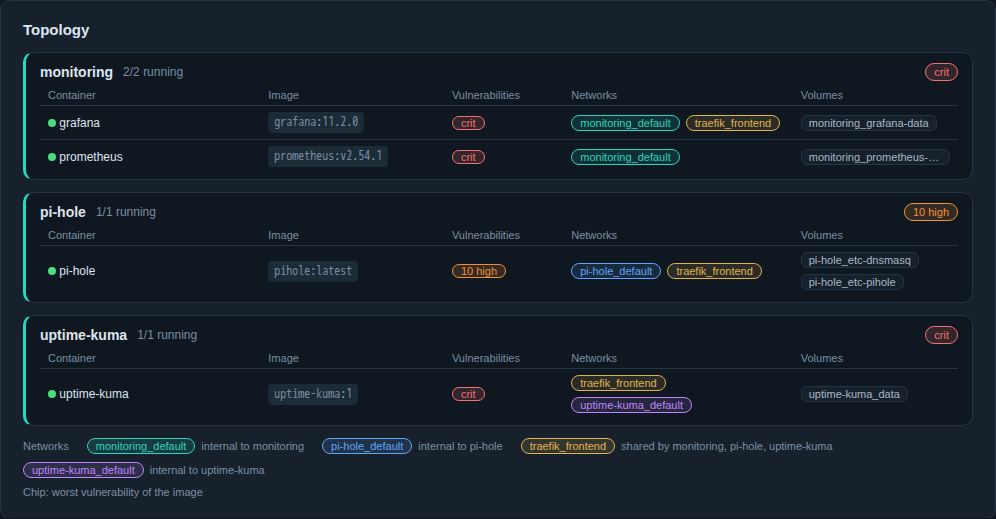

## Docker resources

### Containers
Every container on every host, with stack, image freshness, ports and quick actions.

### Container
Overview, live resources, processes, logs, environment (secrets masked), volumes and networks.

### Images
Unused and dangling images, ready for a bulk clean-up, and each image in use with its vulnerabilities when scanning is on.

### Volume browser
Browse, edit, upload and download files inside a volume (admin only).

## Volume backups

### Backups
Named volumes copied to a SMB share on a schedule: the jobs, and the history of their runs.

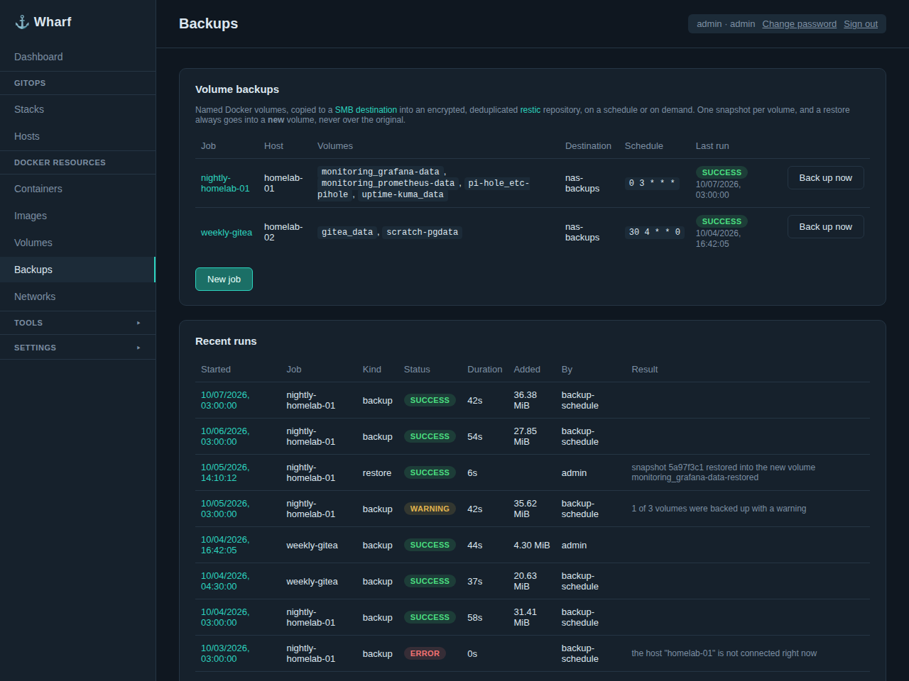

### A job
Its volumes, schedule, how the containers are treated, the retention rule, whether the repository exists on the share, and the history.

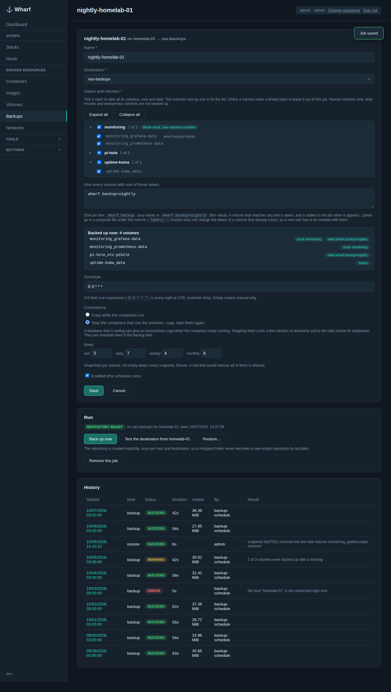

### Choosing the volumes
Stacks with their volumes in a tree, label rules, and a preview of what the job covers and why.

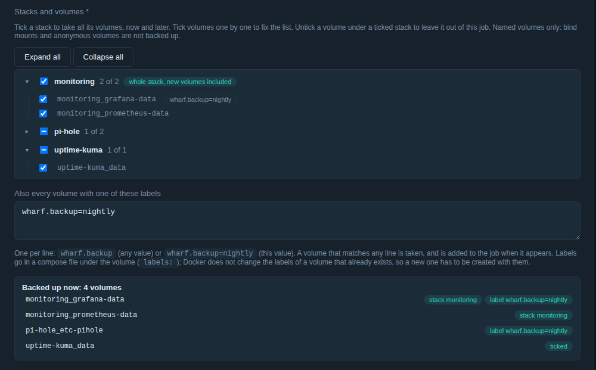

### A run
Each volume with its snapshot, its size, what it added to the repository and what retention did.

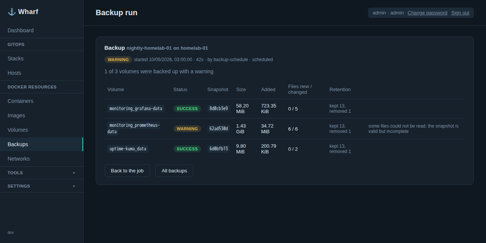

### Destinations
Where the backups go: a SMB share, set up once and used by any number of jobs.

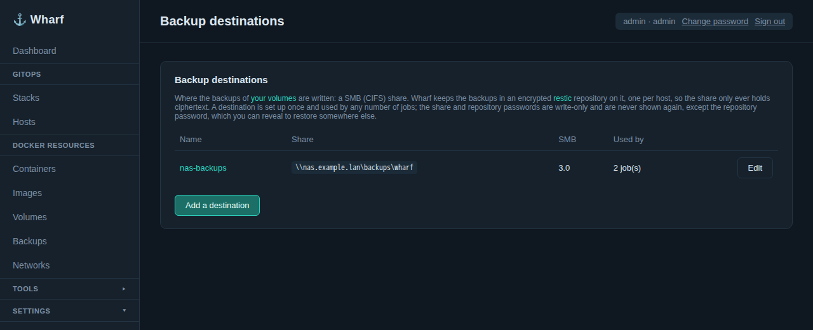

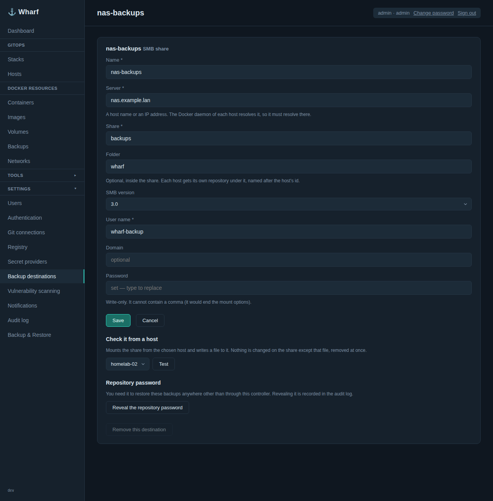

### Repository password
Shown once when a destination is created; an administrator can show it again, which is audited.

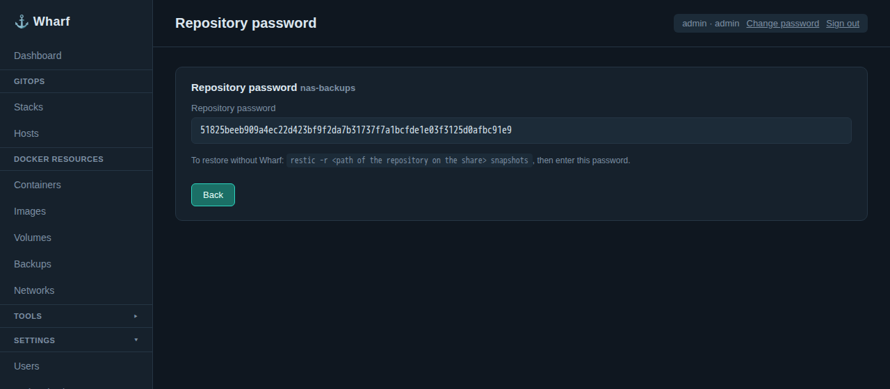

## Vulnerability scanning

### Settings
Optional, off by default: Trivy or Grype, downloaded on demand, reading each image from its registry by digest.

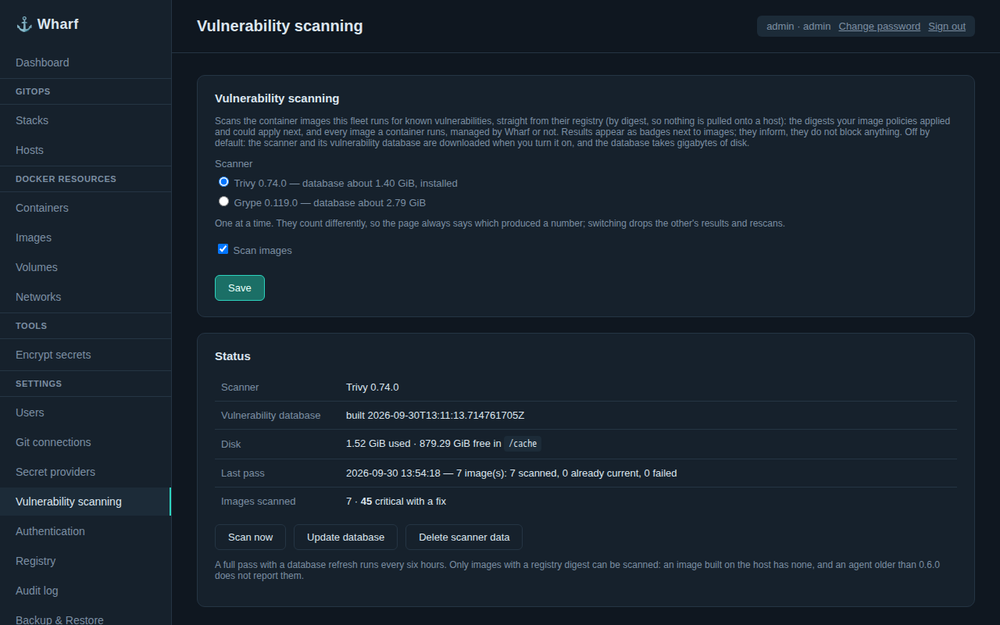

### A stack's images
What is applied and what an update would bring, each with its vulnerabilities.

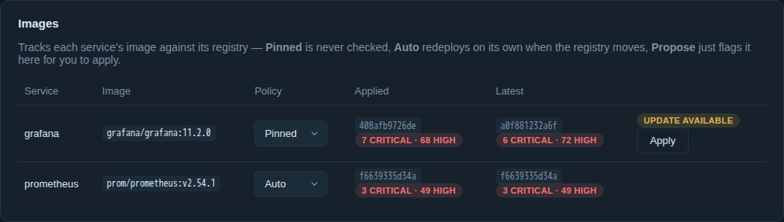

### Findings
Every vulnerability of an image, filterable to what has a fix.

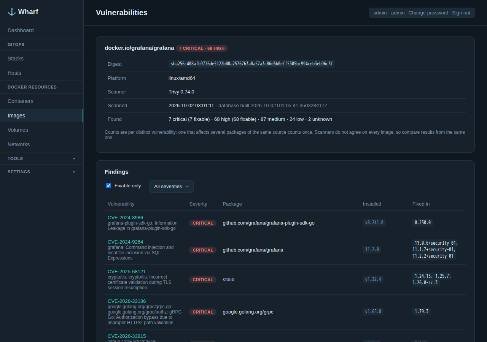

## Secrets

### Encrypt secrets
Encrypt a `secrets.enc.yaml` for a stack in the browser, as plain age or SOPS, without installing either.

### Secret providers
Shared connections to OpenBao / Vault and to Bitwarden Secrets Manager, for `ref+vault://` and `ref+bws://` references in a stack's `secrets.refs.yaml`. Each connection lists its address and its path rules; Bitwarden's tool is downloaded from here, after the licence is accepted.

### Attaching a provider to a stack
Which connection a stack goes through, with which credentials. When the connection has path rules, the paths box is optional and says what the rules already give the stack; without rules it lists every path the stack may read.

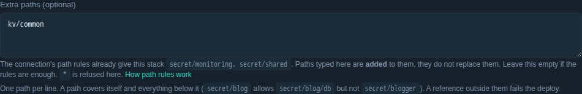

## Access and settings

### Git connections
Shared SSH keys or HTTP credentials several stacks can use.

### Private registries
Credentials used both for the image update check and for pulls at deploy time.

### Users
Admin and operator roles, local and SSO accounts.

### Single sign-on
Any standard OIDC provider, with admin and operator groups.

